<div align="center">



<a href="README.md">
  
</a>
<a href="#">
  
</a>
<a href="README.zh.hant.md">
  
</a>
<a href="README.ja.md">
  
</a>

# Plangothic Project

<a href="https://github.com/Fitzgerald-Porthmouth-Koenigsegg/Plangothic_Project/stargazers">
  
</a>
<a href="https://github.com/Fitzgerald-Porthmouth-Koenigsegg/Plangothic_Project/forks">
  
</a>
<a href="https://github.com/Fitzgerald-Porthmouth-Koenigsegg/Plangothic_Project/issues">
  
</a>
<br/>

<a href="https://github.com/Fitzgerald-Porthmouth-Koenigsegg/Plangothic_Project/releases/latest">
  
</a>
<a href="https://github.com/Fitzgerald-Porthmouth-Koenigsegg/Plangothic_Project/releases/latest">
  
</a>
<a href="https://github.com/Fitzgerald-Porthmouth-Koenigsegg/Plangothic_Project/actions">
  
</a>

<a href="https://github.com/Fitzgerald-Porthmouth-Koenigsegg/Plangothic_Project/commits">
  
</a>
<a href="https://github.com/Fitzgerald-Porthmouth-Koenigsegg/Plangothic_Project/commits">
  
</a>
<br/>

<a href="https://github.com/Fitzgerald-Porthmouth-Koenigsegg/Plangothic_Project/blob/main/LICENSE-OFL.txt">
  
</a>
<a href="https://github.com/Fitzgerald-Porthmouth-Koenigsegg/Plangothic_Project/blob/main/LICENSE-MIT.txt">
  
</a>
<a href="https://www.bilibili.com/video/BV1Dr4y1V7b7">
  
</a>
</div>

## Overview
Plangothic Project (Chinese: 遍黑体项目) is based on [Source Han Sans](https://github.com/adobe-fonts/source-han-sans) CN and takes the Chinese Mainland variant ideographs as the standard to supplement the CJK Unified Ideographs Extension blocks. Initiated around June 2020.

## Coverage
This font mainly supports all CJK ideographs from extension B to extension J, with sporadic character in other blocks.

## Contributors
- Main:  [Usagixineist](https://github.com/Usagixineist), [WAAO-SCREAMER](https://github.com/WAAO-SCREAMER), Nachicraft, Magnetshroom
- Assistants: [0xAA55](https://github.com/0xAA55), [Baysoftware](https://github.com/yi-bai), Boris Ivanovich, [Henry Chan](https://github.com/hfhchan), [Hulenkius](https://github.com/Hulenkius), [Losketch](https://github.com/Losketch)

There are also many other people who have supported and participated in the project. We would like to thank them.

## License

### Font Files (OFL 1.1 License)
**Scope:** All font files in the `fonts/` and `sources/` directories

**You can:**
- Use for free commercial and non-commercial purposes without authorization
- Embed in software, web pages, or devices for distribution
- Modify and convert formats (modified versions must maintain OFL license and cannot use "Plangothic"/"遍黑" names)

**You cannot:**
- Sell font files separately
- Change to other license agreements
- Use for illegal purposes

### Build Tools (MIT License)
**Scope:** Source code, scripts, and configuration files in the `tools/`, `registry/`, `sources/build.py`, and `.github/workflows/` directories

Free to use, modify, and distribute, including for commercial purposes.

---

**Important Notice:**
- Using any content in this repository indicates agreement to comply with the respective licenses
- This font is completely free - any paid acquisition is fraudulent behavior
- For detailed terms, please refer to [LICENSE-OFL.txt](LICENSE-OFL.txt) and [LICENSE-MIT.txt](LICENSE-MIT.txt)

## FAQ
### 1. Why are there two font files for Plangothic?
- Because the maximum number of glyphs a font can hold is limited (to 65535), while the total count of CJK ideographs is much greater than this value.
### 2. Why does this project just include a small amount of CJK ideographs in the URO and extensions A?
- Since the purpose of this project is "supplement all the extension blocks of CJK Unified Ideographs based on [Source Han Sans](https://github.com/adobe-fonts/source-han-sans) CN", needs of using CJK ideographs in the URO and Extension A blocks can be solved by directly using the Source Han Sans font. As for these CJK ideographs scattered in the URO and Extension A, included in this project are CJK ideographs with glyph changes in Unicode or inconsistent with the purpose of this project. Before adding these CJK ideographs to the project, they have been compared with other mainstream fonts and glyphs in the Unicode.
### 3. Will there be a version containing other weights (or other local glyphs) in the future?
- Since the quantities of this project are too large, so this request is not in our reach by now. If you have such ideas, you can make a derivative font version of the project with your requirements.
### 4. Why is there no ℂomplex 𝕋ext 𝕃ayout (CTL) and 𝕀deographs 𝕍ariation 𝕊electors (IVS) in this font?
- The fonts of this project orientate themselves as pragmatic tool fonts, that is they are not responsible for precise typesetting but only for display (see [Unifont](https://unifoundry.com/unifont) and [Noto Unicode](https://github.com/MY1L/Unicode/tree/main/NotoUnicode) developed by [My1l](https://github.com/MY1L)). Using CTL to typeset and display these scripts, and displaying regional variation ideographs other than the CN variant using IVSs is OUTSIDE the coverage of the project. If you have such ideas, you can produce derivation fonts of this project by yourself if in need.
### 5. Can the TTC font from this project (a collection of multiple TrueType fonts) be directly used on smartphones or within software? Can it be installed on a phone to display all font styles simultaneously? Are there compatibility issues across software platforms or is it limited to specific platforms?
- The TTC font from this project is compatible with Windows platforms and works seamlessly there. However, on mobile devices, directly installing a TTC font file typically results in displaying only one font style (usually P1) due to technical constraints. To display all font styles within software applications, special configurations may be required. Compatibility with TTC fonts can vary across different platforms, often requiring additional steps. Detailed instructions for installing Plangothic on an Android phone are provided here.

<details>
<summary><b>P.S.: How to install Plangothic font on the Windows platform and set it as the global fallback font:</b></summary>

1. Download the TTF version of the font file (choose either two separate ttf files or a single ttc file).
2. In File Explorer, select the font file, then **click right mouse button→"Install for all users"(requires administrator privileges, Windows 11 users also need to click "Show more options")** to install the font file.
3. Download the registry file `reg/Plangothic-Install.reg`, double-click to run it (requires administrator privileges), and if a security warning appears, click "Run".
4. Log out and log back in to the Windows system account for the settings to take effect.
5. To delete the font, simply delete the font file itself, and there is no need to change the registry settings. If you want to delete the registry content, download the file `reg/Plangothic-Uninstall.reg`and double-click to run it.
</details>

<details>
<summary><b>P.S.: Method for installing the Plangothic on the phone:</b></summary>

To install the Plangothic TTC font on an Android phone, follow these steps:
1. Backup the `/system/etc/fonts.xml` and `/system/etc/font_fallback.xml` files of your current phone system (if available).
2. Open the `system/etc/fonts.xml` and `/system/etc/font_fallback.xml` files.
3. After the closing `</family>` tag of `<family lang="ko">`, insert a new line.
4. Add the following XML code snippet with correct indentation:
``` xml
    <family>
        <font weight="400" style="normal" index="0">Plangothic.ttc</font>
        <font weight="400" style="normal" index="1">Plangothic.ttc</font>
    </family>
``` 
After completing these steps, restart your phone to apply the changes. If you encounter issues, verify that the font files have been correctly updated and ensure that your device permissions allow modifications to system files.

Please note that the above methods are **NOT applicable** to Apple phone users and cannot provide installation methods for Apple phone users. We apologize for any inconvenience caused.
</details>

## Contact
If you have any questions or suggestions during the use of this font, please feel free to provide feedback. You can submit an issue in the project (unrelated content is strictly prohibited), or you can provide feedback through the following contact information:
- GitHub: https://github.com/Fitzgerald-Porthmouth-Koenigsegg
- Twitter: https://twitter.com/Fitzgerald_P_K_/
- E-mails: 374601620@qq.com (Backup email: fitzgeraldkoenigsegg@gmail.com)

## Other instructions
1. Due to certain reasons, we DO NOT have any discussion groups (Telegram, Discord, etc.), and we deeply apologize for any inconvenience caused to you.
2. This is a long-term project. We would be grateful if you could promote the project to others. We also welcome technical personnels in font production and accept you to continue to improve this project. You can contact the author through said information. The development of this project is inseparable from your publicity and encouragement.
3. The members of this project are not professional font designers, so the font structure may not be aesthetically pleasing, and the added text may have a slight inconsistency compared to the original version. In addition, due to the limited time and energy of the members, there is no extra time for the project to refine. Some parts of the Chinese characters will be assembled very rigidly. Therefore, we cannot guarantee the accuracy of the font data and whether the expected presentation effect can be perfectly reproduced on your device. The author makes no express or implied warranties about this font, nor assumes any responsibility for any claims, damages, or attributable reasons arising from your use of this font.
4. Some of the Chinese Mainland glyphs included in this font **DO NOT** fully follow the fonts displayed in the [Unicode charts file](https://www.unicode.org/charts/). If you mind or cannot accept, please do not use this font.
5. This project borrows and/or refers to other tools and/or open-source font projects in part or whole, mainly including:
    - [Source Han Sans](https://github.com/adobe-fonts/source-han-sans).
    - Other fonts in the Noto series.
    - [Sukima Gothic (すきまゴシック)](https://oppekebekkanko.booth.pm/items/2117070) developed by [oppekebekkanko](https://oppekebekkanko.booth.pm/).
    - [Noto Unicode](https://github.com/MY1L/Unicode/tree/main/NotoUnicode) developed by [My1l](https://github.com/MY1L).
    - [Chiron Hei HK](https://github.com/chiron-fonts/chiron-hei-hk)。
    - [Zhudou-Sans](https://github.com/Buernia/Zhudou-Sans) developed by [Buernia](https://github.com/Buernia).
    - [Zitools](https://zi.tools) developed by [Yi Bai](https://github.com/yi-bai).
    - [Gothic Nguyen](https://github.com/TKYKmori/Gothic-Nguyen).
    - [Unicode charts file](https://www.unicode.org/charts/).
    - [Unihan database](https://www.unicode.org/Public/16.0.0/ucd/Unihan.zip).
    - [Shokaki Hentaigana Gothic（しょかき変体仮名ゴチック）](https://shokaki.booth.pm/items/5633978) developed by [ぼんのう堂](https://shokaki.booth.pm).
    - [Unicodia](https://github.com/Mercury13/unicodia/).
6. The glyph data of this project is provided by [Hulenkius](https://github.com/Hulenkius) in SVG format. Users can access the glyphs via the link:  
「<https://seeki.vistudium.top/SVG/{lowercase-hex-unicode}.svg>」

    Example: `` will display as:  
<div align="center"></div>

Additionally, you can experience the **SVG-VF Dynamic Glyph Demo** (with interactive weight and style adjustments) through the following link:  
「[SVG-VF Dynamic Experience](https://losketch.github.io/Plgo/VF)」

> [!IMPORTANT]
> - The online SVG files only cover CJK Unified Ideographs Extension B to Extension I.
> - The online SVG files are not fully synchronized with this project's updates. Use with caution.
> - **The SVG-VF dynamic glyph feature is experimental**. Rendering compatibility issues may occur. Modern browsers (e.g., Chrome 120+, Firefox 121+) are recommended.

## About "The Planiverse"
Founded by Fitzgerald in December 2023 and includes several sub-projects currently as follows:
1. **Plangothic Project (Chinese: 遍黑体项目)**: Based on Source Han Sans CN and takes the CN variant as the standard to supplement the CJK Unified Ideographs Extension blocks.
    - **Status**: Keep up with the latest version of Unicode.
2. **Planwritzen Project (Chinese: 遍蕤体项目)**: Based on Fitzgerald's own handwriting and using the Plangothic Project as the standard. Character range set to align with the Source Han Sans + Plangothic Project temporarily (or there may be an extension).
    - **Status**: Created project without homepage. Uncompleted.
3. **Planschrift Project (Chinese: 遍玨体项目)**: Based on Huiwen-mincho supplementing the CJK Unified Ideographs Extension blocks. Temporary character range expanded from the range of Huiwen-mincho to Source Han Sans + Plangothic Project.
    - **Status**: Created project and its [homepage](https://github.com/Fitzgerald-Porthmouth-Koenigsegg/Planschrift_Project). Uncompleted.
4. **Planseal Project (Chinese: 遍篆体项目)**: Based on the seal script in *Shuowen Jiezi* and as the standard to supplement the CJK Unified Ideographs Extension blocks.
    - **Status**: Not created. Name tentative, In the future, it may merge with the Plangothic project and become a part of it.
5. **Planicon Project (Chinese: 遍象体项目)**: Based on CJK ideographs icons in the [Zi.tools](https://zi.tools/) and as the standard to supplement the CJK Unified Ideographs Extension blocks. Temporary character range set to URO and Extension A. Other ideographs are partly available.
    - **Status**: Not created. Name tentative.
6. **Plantsing Project (Chinese: 遍擎体项目)**: Based on the Wuying Hall version of *Kangxi Dictionary* and as the standard to supplement the CJK Unified Ideographs Extension blocks. Temporary character range set to align with the Plangothic Project.
    - **Status**: Not created.
7. ***Plangul Project (Chinese: 遍训体项目)***: Based on Source Han Sans CN, creating Hangul in the form of CJK ideographs. Temporary  character range set to Hangul and Hangul Extension.
    - **Status**: Merge with the Plangothic project and become a part of it.
8. **Planfixibit Project (Chinese: 遍缮体项目)**: Based on [Fixedsys Excelsior](https://github.com/kika/fixedsys), Follow up on the latest version of Unicode and implement character supplementation projects.
    - **Status**: Not created. Name tentative.
9. **Plantone Project (Chinese: 遍磊体项目)**: Based on the *Kaicheng Stone Classics* and as the standard to supplement the CJK Unified Ideographs Extension blocks.
    - **Status**: Not created. Name tentative.
> [!WARNING]
>
> 1. Strictly speaking, Planicon Project, Planfixibit Project, Plangul Project does not meet the requirements for "The Planiverse", but still included for convenience.
> 2. Prone to Planicon Project copyright disputes.
