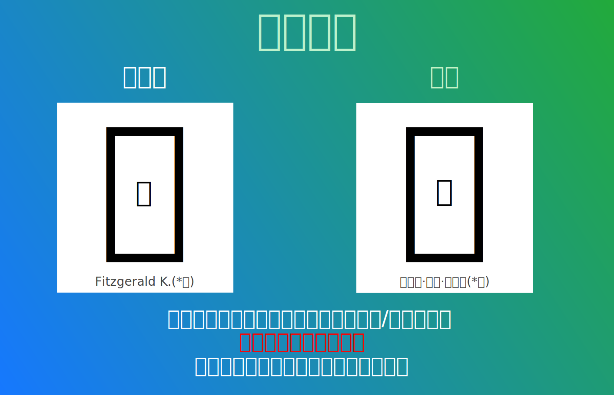

<div align="center">



<a href="#">
  
</a>
<a href="README.en.md">
  
</a>
<a href="README.zh.hant.md">
  
</a>
<a href="README.ja.md">
  
</a>

# 遍黑体项目（Plangothic Project）

<a href="https://github.com/Fitzgerald-Porthmouth-Koenigsegg/Plangothic_Project/stargazers">
  
</a>
<a href="https://github.com/Fitzgerald-Porthmouth-Koenigsegg/Plangothic_Project/forks">
  
</a>
<a href="https://github.com/Fitzgerald-Porthmouth-Koenigsegg/Plangothic_Project/issues">
  
</a>
<br/>

<a href="https://github.com/Fitzgerald-Porthmouth-Koenigsegg/Plangothic_Project/releases/latest">
  
</a>
<a href="https://github.com/Fitzgerald-Porthmouth-Koenigsegg/Plangothic_Project/releases/latest">
  
</a>
<a href="https://github.com/Fitzgerald-Porthmouth-Koenigsegg/Plangothic_Project/actions">
  
</a>

<a href="https://github.com/Fitzgerald-Porthmouth-Koenigsegg/Plangothic_Project/commits">
  
</a>
<a href="https://github.com/Fitzgerald-Porthmouth-Koenigsegg/Plangothic_Project/commits">
  
</a>
<br/>

<a href="https://github.com/Fitzgerald-Porthmouth-Koenigsegg/Plangothic_Project/blob/main/LICENSE-OFL.txt">
  
</a>
<a href="https://github.com/Fitzgerald-Porthmouth-Koenigsegg/Plangothic_Project/blob/main/LICENSE-MIT.txt">
  
</a>
<a href="https://www.bilibili.com/video/BV1Dr4y1V7b7">
  
</a>

<a href="http://qm.qq.com/cgi-bin/qm/qr?_wv=1027&k=HvSdPx6z78suzTz51M3xGe-gENeaa1yc&authKey=eHjDZI54yDVbhyFjQqA2ImtV35LFy%2Fit8EuAzVDscVPcACE23L0hT314LiU9ey2%2F&noverify=0&group_code=1135661191">
  
</a>
</div>

## 概述
遍黑体项目是基于[思源黑体](https://github.com/adobe-fonts/source-han-sans)，并以中国大陆字形为标准的对中日韩统一表意文字扩展区进行字形补充的项目，是「遍宇宙家族」中的一个子项目，该项目于2020年6月前后启动。

## 收录范围
本字体主要支援扩展B区至扩展J区的全部汉字，其他区块有零星的字符。

## 贡献者
- 主制作：[Usagixineist](https://github.com/Usagixineist)、[WAAO-SCREAMER](https://github.com/WAAO-SCREAMER)、Nachicraft、Magnetshroom
- 其他技术协助：[0xAA55](https://github.com/0xAA55)、[Baysoftware](https://github.com/yi-bai)、Boris Ivanovich、[Henry Chan](https://github.com/hfhchan)、[Hulenkius](https://github.com/Hulenkius)、[Losketch](https://github.com/Losketch)

还有不少其他曾经向遍黑体项目给予支持、参与制作的人员，也在此对他们表示感谢。

## 授权协议

### 字体文件（OFL 1.1协议）
**适用范围：** `fonts/` 和 `sources/` 目录下的所有字体文件。

授权协议的中文文本参考（非官方译本）：https://www.maoken.com/ofl‌‌‌‌‌‌ 。

#### 您可以：
- 任何个人、团体、组织及企业可免费进行商业目的和非商业目的使用，无需支付费用、事先告知作者、标明来源信息或征得作者许可。
- 对字体文件进行二次发布或安装、嵌入到任何软件或设备中，同时软件或设备可被再次分发或销售。
- 对字体文件进行修改、扩充和格式转换，但二次修改的作品**严禁使用本字体的保留名称「Plangothic」、「遍黑」**，二次修改过后的版本**亦须以 SIL Open Font License 发表**（若仅对源字体进行格式转换可继续使用该保留名称）。

#### 您不可以：
- 对字体文件中的任何部分（包括但不限于字形、OpenType特性逻辑）进行倒卖兜售，如将字体文件单独售卖，与其他字体进行捆绑售卖、需付费办理特殊权限才可使用字体等。
- 将字体文件中的任何部分以非SIL Open Font License授权协议发表。
- 利用本字体文件或其衍生品进行危害计算机系统正常进行的行为（包括但不限于在字体文件中嵌入计算机病毒、主观故意利用程序或系统存在的漏洞来扰乱计算机系统的正常运作等）。
- 将本字体用作违反当地法律法规的用途。
- 其他上述未列明的违反SIL Open Font License授权协议的行为。

### 构建工具（MIT协议）
**适用范围：** `tools/`、`registry/`、`sources/build.py`、`.github/workflows/` 目录下的源代码、脚本与配置文件。

- 可自由使用、修改、分发，包括商业用途。

---

**重要提醒：**
- 使用本仓库中的任何内容，即默认视为同意遵守相应协议，详细的条款内容请参见[LICENSE-OFL.txt](LICENSE-OFL.txt)和[LICENSE-MIT.txt](LICENSE-MIT.txt)。
- 本字体为免费商用字体，**凡是需要付费来获得该字体的行为，都是诈骗行为，谨防上当受骗**。如您是付费获得的此字体，请立刻对其进行举报，必要时可协助相关司法机关。
- 作者不行使、未能及时行使或未充分行使授权协议中所享有的合法权利，不视为放弃该权利，也不影响作者在将来行使该权利。
- 本仓库中的所有内容不包含任何政治意图、隐喻及目的，与一切政治活动无关。作者不承担您使用该字体所产生的任何连带法律责任。

## 常见问题
### 1. 为什么遍黑体是两个字体文件？
- 因为一个字体所能容纳的字形数量有限（65535 个），而表意文字的总数量远大于这个值。
### 2. 为什么这个项目包含少量基本区和扩展 A 区的汉字？
- 因为本项目的宗旨是「基于[思源黑体](https://github.com/adobe-fonts/source-han-sans)进行的补充」，如需显示基本区和扩展 A 区的表意文字，直接使用思源黑体即可。本项目中所包含的零星的基本区和扩展 A 区的表意文字均为在 Unicode 内**有字形改动或者不符合本项目宗旨**的表意文字。本项目在添加这些表意文字之前均已与其他主流字体和 Unicode 码表内字形进行过比对。
### 3. 未来是否会做包含其他字重（或其他地区字形）的版本？
- 因为本项目工程量过于庞大，所以不会有此打算。若您有类似想法，可自行制作有关于您需求的该项目的衍生字体版本。
### 4. 为什么这个项目里的字体没有复杂文种排版（ℂomplex 𝕋ext 𝕃ayout, CTL）或是异体字选择器（𝕀deographs 𝕍ariation 𝕊electors, IVS）功能？
- 因为本项目的字体使用性质侧重于工具字体、亦即不负责排版仅负责显示（类似于[Unifont](https://unifoundry.com/unifont)和[绵云饴里](https://github.com/MY1L)所开发的[Noto Unicode](https://github.com/MY1L/Unicode/tree/main/NotoUnicode)），使用复杂文种处理准确地排版这些语言文字，或是使用异体字选择器显示其它地区字形的功能**并不在**本项目的涵盖范围内。若您有类似的想法，可自行制作满足您需求的衍生字体。
### 5. 本项目的TTC字体（即多个TrueType字体的合并）是否可以直接用于手机或在软件中使用？即是否可以直接安装在手机上并显示所有字形？遇到的问题是否适用于所有软件平台，或者只限于特定平台？
- 本项目的TTC字体适用于Windows平台，可以正常使用。因为其他原因，对于手机设备直接安装TTC字体文件只能显示其中的一个字形（通常是P1），无法同时显示所有字形。在软件中使用时，可能需要特殊设置才能显示TTC字体中的所有字形。不同平台对TTC字体的兼容性可能有所不同，但大多数情况需要额外步骤。

<details>
<summary><b>附：将遍黑体安装至Windows平台并全局Fallback的方法：</b></summary>

1. 下载TTF版字体文件（两个单独的ttf或者单个的ttc文件任选其一）；
2. 在资源管理器上选择字体文件，然后点击**鼠标右键→“为所有用户安装”（需要管理员权限，Win11用户还需要点击“显示更多选项”）**，安装字体文件；
3. 下载注册表文件`reg/Plangothic-Install.reg`，双击运行（需要管理员权限），若出现安全警告请点击“运行”；
4. 注销并重新登录Windows系统账户，设置即可生效；
5. 若要删除字体，则仅需删除字体本体即可，注册表设置无需变动。如果要删注册表内容，下载文件`reg/Plangothic-Uninstall.reg`，双击运行即可。
</details>

<details>
<summary><b>附：将遍黑体安装至手机的方法：</b></summary>

要将TTC字体安装至Android手机，请遵循以下步骤：
1. 备份当前手机系统的 `/system/etc/fonts.xml` 和 `/system/etc/font_fallback.xml` （如果有）文件；
2. 打开 `system/etc/fonts.xml` 和 `/system/etc/font_fallback.xml` （如果有）文件；
3. 在文件的 `<family lang="ko">` 标签后，找到闭合标签 `</family>` 后回车；
4. 添加以下 XML 代码，确保正确缩进：
``` xml
    <family>
        <font weight="400" style="normal" index="0">Plangothic.ttc</font>
        <font weight="400" style="normal" index="1">Plangothic.ttc</font>
    </family>
``` 
在完成这些步骤后，重新启动手机以使更改生效。如果仍然遇到问题，请检查是否正确更新了字体文件，并确保设备权限允许修改系统文件。

另请注意，以上方法**不适用**于苹果手机的用户，亦无法提供针对苹果手机用户的安装至手机的方法，敬请谅解。
</details>

## 支持我们
「不积跬步，无以至千里。」遍黑体项目制作难度大，制作时间长，若愿意支持我们，在此致以诚挚感谢！您的捐助可以帮助遍黑体项目以更好发展。您还可以通过其他方式做出贡献，如帮助检查错误字形，对不美观字形提出改进意见等。

在您捐助之前请务必注意以下几点：
- 捐款前请务必仔细确认付款账户（支付宝：Fitzgerald K.、微信：蔽芪茢·茇䓮·蓲䒤菥。如用户名有改动，则第一时间会做出更正），我们无法承担您受骗的损失。
- 目前只有这一个页面是正式的受捐页面。如果您在其它地方看到此项目的捐款链接，请立刻对其进行举报，必要时可协助相关司法机关。
- 您向本项目捐助，即默认表明您赞同我们的理念，并愿意以此种方式支持我们的发展。捐助者提出的意见会被认真考虑，但捐款再多也没有权利以个人意志改变本项目的宗旨和公益性质。
- 捐助后如愿意，可留言写明您的捐款时间和金额，感谢您对本项目的支持。
- 所有捐助资金均会逐一记录，并将全部用于该项目的技术支持等开销，不会被私用。


## 联系方式
您在使用本字体的过程中如有任何问题和建议，欢迎反馈。您可在项目中提交issue（严禁提交无关内容），也可以通过下列联系方式进行反馈：
- GitHub: https://github.com/Fitzgerald-Porthmouth-Koenigsegg
- Twitter: https://twitter.com/Fitzgerald_P_K_/
- 邮箱: 374601620@qq.com（备用邮箱：fitzgeraldkoenigsegg@gmail.com）
- QQ: 374601620

## 其他说明
1. 任何人都可以参与到遍黑体项目的制作中，但需确保您对地区字形、字形美观、软件使用、Unicode 等方面有一定的基础，关于此方面可加入该项目的 QQ 群 [1135661191](http://qm.qq.com/cgi-bin/qm/qr?_wv=1027&k=HvSdPx6z78suzTz51M3xGe-gENeaa1yc&authKey=eHjDZI54yDVbhyFjQqA2ImtV35LFy%2Fit8EuAzVDscVPcACE23L0hT314LiU9ey2%2F&noverify=0&group_code=1135661191) 进行详细商讨质询。
2. 本项目长期招贤纳士，您可以动用自己的一份力，让身边更多的人了解该企划。我们也欢迎字体制作方面的技术人才，欢迎大家继续完善该项目，您可以通过上面的联系方式与作者联系。遍黑体项目的发展离不开你们的宣传和鼓励。
3. 本项目成员并不是专业的字体设计师，所以会导致字体的字形结构可能不甚美观，补字与原版相比可能略有违和感。此外由于成员的时间与精力有限，项目并没有多余的时间精修，部分汉字的部件拼接会很生硬，因此作者无法保证字体本身数据的准确性及预期呈现效果在您的设备是否能够完美复现，作者不对本字体作任何明示或暗示的保证，亦不承担您使用该字体所产生的任何索赔、损害或可归责事由而来的任何责任。
4. 本字体包含的部分国标字形**未完全遵循**[Unicode官方码表文件](https://www.unicode.org/charts/)中所展示的字形，十分介意者请勿使用。
5. 本项目部分或全部借用或参考了其他工具或开源字体项目，主要包括：
    - [思源黑体](https://github.com/adobe-fonts/source-han-sans)。
    - Noto系列里的其他字体。
    - [oppekebekkanko](https://oppekebekkanko.booth.pm/)所开发的[すきまゴシック（Sukima Gothic、隙间黑体）](https://oppekebekkanko.booth.pm/items/2117070)。
    - [绵云饴里](https://github.com/MY1L)所开发的[Noto Unicode](https://github.com/MY1L/Unicode/tree/main/NotoUnicode)。
    - [昭源黑体](https://github.com/chiron-fonts/chiron-hei-hk)。
    - [奈白不弍](https://github.com/Buernia)所开发的[煮豆黑体](https://github.com/Buernia/Zhudou-Sans)。
    - [白易](https://github.com/yi-bai)所开发的[字统网](https://zi.tools)。
    - [Gothic Nguyen（阮黑体）](https://github.com/TKYKmori/Gothic-Nguyen)。
    - [Unicode官方码表文件](https://www.unicode.org/charts/)。
    - [Unihan数据库](https://www.unicode.org/Public/17.0.0/ucd/Unihan.zip)。
    - [ぼんのう堂](https://shokaki.booth.pm)所开发的[しょかき変体仮名ゴチック（Shokaki Hentaigana Gothic）](https://shokaki.booth.pm/items/5633978)。
    - [Unicodia](https://github.com/Mercury13/unicodia/)。
    - [尚古黑体](https://github.com/GuiWonder/Shanggu)。
6. 该项目的字形资料由[Hulenkius](https://github.com/Hulenkius)通过SVG文件进行线上使用，使用者可以通过「<https://seeki.vistudium.top/SVG/{小写的汉字十六进制码位}.svg>」链接获取。

    例：``的显示结果将会是：
<div align="center"></div>

此外，您可以通过以下链接在线体验 **SVG-VF 动态版字形 Demo**（支持交互式字重与样式调节）：  
「[SVG-VF 动态体验](https://losketch.github.io/Plgo/VF)」

> [!IMPORTANT]
> - 线上的 SVG 文件仅包含中日韩统一表意文字扩展 B 区至中日韩统一表意文字扩展 I 区。
> - 线上的 SVG 文件不和本项目的更新完全同步，请酌情使用。
> - **SVG-VF 动态版字形目前为实验性功能**，可能存在渲染兼容性问题，建议使用现代浏览器（如 Chrome 120+、Firefox 121+）访问。

## 关于「遍宇宙家族」（Planiverse）
该字体家族由 Fitzgerald 在 2023 年 12 月创设，目前涵盖了以下的几个子字体项目：
1. **Plangothic Project（遍黑体项目）**：基于思源黑体，并以中国大陆字形为标准的对中日韩越统一表意文字扩展区进行字形补充的项目。
    - **项目状态**：保持跟进Unicode最新版本中。
2. **Planwritzen Project（遍蕤体项目）**：基于 Fitzgerald 自己的手写体，并以遍黑体项目中的字形为标准的字体项目，其字符收录范围暂定为思源黑体+遍黑体（或可能会有字符范围的扩充）。
    - **项目状态**：已创设项目本体，但未创建项目主页。
3. **Planschrift Project（遍玨体项目）**：基于汇文明朝体，对中日韩越统一表意文字扩展区进行字形补充的项目，其字符收录范围暂定为在汇文明朝体的字符范围基础上扩充至思源黑体+遍黑体。
    - **项目状态**：已创设项目本体和[项目主页](https://github.com/Fitzgerald-Porthmouth-Koenigsegg/Planschrift_Project)，但未完成。
4. **Planseal Project（遍篆体项目）**：基于《说文解字》小篆体，对中日韩越统一表意文字扩展区进行字形补充的项目。
    - **项目状态**：未创设项目本体和项目主页，项目名称暂定，未来可能会与遍黑体项目合并，成为其中的一部分。
5. **Planicon Project（遍象体项目）**：基于字统网中部分汉字图标的字形补充的项目，其字符收录范围暂定为基本区和扩展A区，其他汉字区块散有字形。
    - **项目状态**：已创设项目本体，但未创建项目主页，项目名称暂定。
6. **Plantsing Project（遍擎体项目）**：基于武英殿本《康熙字典》，对中日韩越统一表意文字扩展区进行字形补充的项目，其字符收录范围暂定为与遍黑体项目拉齐。
    - **项目状态**：未创设项目本体和项目主页。
7. ***Plangul Project（遍训体项目）***：基于思源黑体，但以汉字的形式对谚文进行字形制作的项目，其字符收录范围暂定为基本谚文和扩展谚文。
    - **项目状态**：与遍黑体项目合并，成为其中的一部分。
8. **Planfixibit Project（遍缮体项目）**：基于[Fixedsys Excelsior](https://github.com/kika/fixedsys)，跟进最新版本的Unicode，并进行字符补充的项目。
    - **项目状态**：未创设项目本体和项目主页，项目名称暂定。
9. **Plantone Project（遍磊体项目）**：基于《开成石经》，对中日韩越统一表意文字扩展区进行字形补充的项目。
    - **项目状态**：未创设项目本体和项目主页，项目名称暂定。
> [!WARNING]
>
> 1. 严格意义上来说，遍象体项目、遍缮体项目、遍训体项目不符合收录进「遍宇宙家族」的要求，但出于方便考虑，仍然将这三个项目纳入进该家族中。
> 2. 遍象体项目疑似容易产生版权争端。
