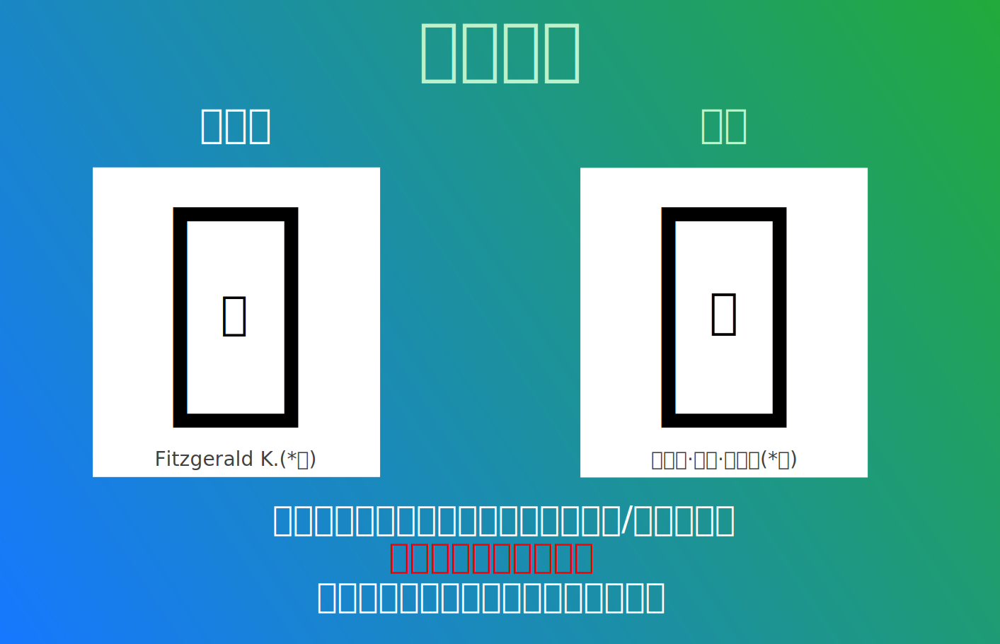

<div align="center">


<a href="README.md">
  
</a>
<a href="README.en.md">
  
</a>
<a href="#">
  
</a>
<a href="README.ja.md">
  
</a>

# 遍黑體項目（Plangothic Project）

<a href="https://github.com/Fitzgerald-Porthmouth-Koenigsegg/Plangothic_Project/stargazers">
  
</a>
<a href="https://github.com/Fitzgerald-Porthmouth-Koenigsegg/Plangothic_Project/forks">
  
</a>
<a href="https://github.com/Fitzgerald-Porthmouth-Koenigsegg/Plangothic_Project/issues">
  
</a>
<br/>

<a href="https://github.com/Fitzgerald-Porthmouth-Koenigsegg/Plangothic_Project/releases/latest">
  
</a>
<a href="https://github.com/Fitzgerald-Porthmouth-Koenigsegg/Plangothic_Project/releases/latest">
  
</a>
<a href="https://github.com/Fitzgerald-Porthmouth-Koenigsegg/Plangothic_Project/actions">
  
</a>

<a href="https://github.com/Fitzgerald-Porthmouth-Koenigsegg/Plangothic_Project/commits">
  
</a>
<a href="https://github.com/Fitzgerald-Porthmouth-Koenigsegg/Plangothic_Project/commits">
  
</a>
<br/>

<a href="https://github.com/Fitzgerald-Porthmouth-Koenigsegg/Plangothic_Project/blob/main/LICENSE-OFL.txt">
  
</a>
<a href="https://github.com/Fitzgerald-Porthmouth-Koenigsegg/Plangothic_Project/blob/main/LICENSE-MIT.txt">
  
</a>
<a href="https://www.bilibili.com/video/BV1Dr4y1V7b7">
  
</a>

<a href="http://qm.qq.com/cgi-bin/qm/qr?_wv=1027&k=HvSdPx6z78suzTz51M3xGe-gENeaa1yc&authKey=eHjDZI54yDVbhyFjQqA2ImtV35LFy%2Fit8EuAzVDscVPcACE23L0hT314LiU9ey2%2F&noverify=0&group_code=1135661191">
  
</a>
</div>

## 概述
遍黑體項目是基於[思源黑體](https://github.com/adobe-fonts/source-han-sans)，並以中國大陸字形為標準的對中日韓統一表意文字擴展區進行字形補充的項目，是「遍宇宙家族」中的一個子項目，該項目於2020年6月前後啟動。

## 收錄範圍
本字體主要支援擴展B區至擴展J區的全部漢字，其他區塊有零星的字元。

## 貢獻者
- 主製作：[Usagixineist](https://github.com/Usagixineist)、[WAAO-SCREAMER](https://github.com/WAAO-SCREAMER)、Nachicraft、Magnetshroom
- 其他技術協助：[0xAA55](https://github.com/0xAA55)、[Baysoftware](https://github.com/yi-bai)、Boris Ivanovich、[Henry Chan](https://github.com/hfhchan)、[Hulenkius](https://github.com/Hulenkius)、[Losketch](https://github.com/Losketch)

還有不少其他曾經向遍黑體項目給予支持、參與製作的人員，也在此對他們表示感謝。

## 授權協議

### 字體文件（OFL 1.1協議）
**適用範圍：** `fonts/` 和 `sources/` 目錄下的所有字體文件

**允許：**
- 免費商業和非商業使用，無需授權
- 嵌入軟體、网页或裝置中分發
- 修改和格式轉換（修改版須保持OFL協議，不得使用"Plangothic"/"遍黑"名稱）

**禁止：**
- 單獨售賣字體文件
- 更改為其他授權協議
- 用於違法用途

### 構建工具（MIT協議）
**適用範圍：** `tools/`、`registry/`、`sources/build.py`、`.github/workflows/` 目錄下的源代碼、腳本與配置文件

可自由使用、修改、分發，包括商業用途。

---

**重要提醒：**
- 使用本倉庫內容即表示同意遵守相應協議
- 本字體完全免費，任何付費獲取都是詐騙行為
- 詳細條款請參見 [LICENSE-OFL.txt](LICENSE-OFL.txt) 和 [LICENSE-MIT.txt](LICENSE-MIT.txt)

## 常見問題
### 1. 為什麼遍黑體是兩個字體檔案？
- 因為一個字體所能容納的字形數量有限（65535個），而表意文字的總數量遠大於這個值。
### 2. 為什麼這個項目僅包含少量基本區和擴展A區的漢字？
- 因為本項目的宗旨是「基于[思源黑體](https://github.com/adobe-fonts/source-han-sans)進行的補充」，如需顯示基本區和擴展A區的表意文字，直接使用思源黑體即可。本項目中所包含的零星的基本區和擴展A區的表意文字均為在Unicode內**有字形改動或者不符合本項目宗旨**的表意文字。本項目在添加這些表意文字之前均已與其他主流字體和Unicode碼表內字形進行過比對。
### 3. 未來是否會做包含其他字重（或其他地區字形）的版本？
- 因為本項目工程量過於龐大，所以不會有此打算。若您有類似想法，可自行製作有關於您需求的該項目的衍生字體版本。
### 4. 為什麼這個項目裏的字體沒有複雜文種排版（CTL）或是異體字選擇器（IVS）功能？
- 因為本項目的字體使用性質側重於工具字體、亦即不負責排版僅負責顯示（類似於[Unifont](https://unifoundry.com/unifont)和[綿雲飴里](https://github.com/MY1L)所開發的[Noto Unicode](https://github.com/MY1L/Unicode/tree/main/NotoUnicode)），使用複雜文種處理準確地排版這些語言文字，或是使用異體字選擇器顯示其它地區字形的功能**並不在**本項目的涵蓋範圍內。若您有類似想法，可自行製作有關於您需求的該項目的衍生字體版本。
### 5. 本項目的TTC字體（即多個TrueType字體的合併）是否可以直接用於手機或在軟件中使用？即是否可以直接安裝在手機上並顯示所有字形？遇到的問題是否適用於所有軟件平台，或者只限於特定平台？
- 本項目的TTC字體適用於Windows平台，可以正常使用。由於其他原因，對於手機設備直接安裝TTC字體文件只能顯示其中的一個字形（通常是P1），無法同時顯示所有字形。在軟件中使用時，可能需要特別設置才能顯示TTC字體中的所有字形。不同平台對TTC字體的兼容性可能有所不同，大多數情況下需要額外的步驟。

<details>
<summary><b>附：遍黑體安裝至Windows平台並全局Fallback的方法：</b></summary>

1. 下載TTF版字型檔案（兩個單獨的ttf或者單個的ttc檔案任選其一）；
2. 在資源管理器上選擇字型檔案，然後點擊**滑鼠右鍵→“為所有使用者安裝”（需要管理員權限，Win11使用者還需要點擊“顯示更多選項”）**，安裝字型檔案；
3. 下載註冊表檔案`reg/Plangothic-Install.reg`，雙擊執行（需要管理員權限），若出現安全警告請點擊“執行”；
4. 註銷並重新登錄Windows系統帳戶，設置即可生效；
5. 若要刪除字型，則僅需刪除字型本體即可，註冊表設置無需變動。如果要刪註冊表內容，下載文件`reg/Plangothic-Uninstall.reg`，雙擊執行即可。
</details>

<details>
<summary><b>附：遍黑體安裝至手機的方法：</b></summary>

要將TTC字體安裝至Android手機，請遵循以下步驟：
1. 備份當前手機系統的 `/system/etc/fonts.xml` 和 `/system/etc/font_fallback.xml` （如果有）文件。
2. 打開 `system/etc/fonts.xml` 和 `/system/etc/font_fallback.xml` （如果有）文件。
3. 在文件的 `<family lang="ko">` 標籤後，找到相應的 `</family>` 標籤後換行。
4. 添加以下 XML 代碼，確保正確縮進：
``` xml
    <family>
        <font weight="400" style="normal" index="0">Plangothic.ttc</font>
        <font weight="400" style="normal" index="1">Plangothic.ttc</font>
    </family>
``` 
完成這些步驟後，重新啟動手機以使更改生效。如果仍然遇到問題，請檢查是否正確更新了字體文件，並確保設備權限允許修改系統文件。

另請注意，以上方法**不適用**於蘋果手機的用戶，亦無法提供針對蘋果手機用戶的安裝至手機的方法，敬請諒解。
</details>

## 支持我們
「不積跬步，無以至千里。」遍黑體項目製作難度大，製作時間長，若願意支持我們，在此致以誠摯感謝！您的捐助可以幫助遍黑體項目以更好發展。您還可以通過其他方式做出貢獻，如幫助檢查錯誤字形，對不美觀字形提出改進意見等。

在您捐助之前請務必注意以下幾點：
- 捐款前請務必仔細確認付款帳戶（支付寶：Fitzgerald K.、微信：蔽芪茢·茇䓮·蓲䒤菥。如用戶名有改動，則第一時間會做出更正），我們無法承擔您受騙的損失。
- 現時只有這一個頁面是正式的受捐頁面。如果您在其它地方看到此項目的捐款連結，請立刻對其進行舉報，必要時可協助相關司法機關。
- 您向本項目捐助，即默認表明您贊同我們的理念，並願意以此種方式支持我們的發展。捐助者提出的意見會被認真考慮，但捐款再多也沒有權利以個人意志改變本項目的宗旨和公益性質。
- 捐助後如願意，可留言寫明您的捐款時間和金額，感謝您對本項目的支持。
- 所有捐助資金均會逐一記錄，並將全部用於該項目的技術支援等開銷，不會被私用。


## 联系方式
您在使用本字體的過程中如有任何問題和建議，歡迎反饋。您可在項目中提交issue（嚴禁提交無關內容），也可以通過下列聯繫方式進行反饋：
- GitHub: https://github.com/Fitzgerald-Porthmouth-Koenigsegg
- Twitter: https://twitter.com/Fitzgerald_P_K_/
- 郵箱: 374601620@qq.com（備用郵箱：fitzgeraldkoenigsegg@gmail.com）
- QQ: 374601620

## 其他說明
1. 任何人都可以參與到遍黑體項目的製作中，但需確保您對地區字形、字形美觀、軟體使用、Unicode等方面有一定的基礎，關於此方面可加入該項目的QQ群[1135661191](http://qm.qq.com/cgi-bin/qm/qr?_wv=1027&k=HvSdPx6z78suzTz51M3xGe-gENeaa1yc&authKey=eHjDZI54yDVbhyFjQqA2ImtV35LFy%2Fit8EuAzVDscVPcACE23L0hT314LiU9ey2%2F&noverify=0&group_code=1135661191)進行詳細商討質詢。另外，本項目目前只有這一個用來交流的討論組，由於某些原因，我們無任何海外討論群組（Telegram、Discord等），給您帶來的不便深表歉意。
2. 本項目長期招賢納士，您可以動用自己的一份力，讓身邊更多的人瞭解該企劃。我們也歡迎字體製作方面的技術人才，歡迎大家繼續完善該項目，您可以通過上面的聯繫方式與作者聯系。遍黑體項目的發展離不開你們的宣傳和鼓勵。
3. 本項目成員並不是專業的字體設計師，所以會導致字體的字形結構可能不甚美觀，補字與原版相比可能略有違和感。此外由於成員的時間與精力有限，項目並沒有多餘的時間精修，部分漢字的部件拼接會很生硬，因此作者無法保證字體本身數據的準確性及預期呈現效果在您的設備是否能够完美複現，作者不對本字體作任何明示或暗示的保證，亦不承擔您使用該字體所產生的任何索賠、損害或可歸責事由而來的任何責任。
4. 本字體包含的部分國標字形**未完全遵循**[Unicode官方碼表文件](https://www.unicode.org/charts/)中所展示的字形，十分介意者請勿使用。
5. 本項目部分或全部借用或參考了其他工具或開源字體項目，主要包括：
    - [思源黑體](https://github.com/adobe-fonts/source-han-sans)。
    - Noto系列裡的其他字體。
    - [oppekebekkanko](https://oppekebekkanko.booth.pm/)所開發的[すきまゴシック（Sukima Gothic、隙間黑體）](https://oppekebekkanko.booth.pm/items/2117070)。
    - [綿雲飴里](https://github.com/MY1L)所開發的[Noto Unicode](https://github.com/MY1L/Unicode/tree/main/NotoUnicode)。
    - [昭源黑體](https://github.com/chiron-fonts/chiron-hei-hk)。
    - [奈白不弍](https://github.com/Buernia)所開發的[煮豆黑體](https://github.com/Buernia/Zhudou-Sans)。
    - [白易](https://github.com/yi-bai)所開發的[字統網](https://zi.tools)。
    - [Gothic Nguyen（阮黑體）](https://github.com/TKYKmori/Gothic-Nguyen)。
    - [Unicode官方碼表文件](https://www.unicode.org/charts/)。
    - [Unihan數據庫](https://www.unicode.org/Public/16.0.0/ucd/Unihan.zip)。
    - [ぼんのう堂](https://shokaki.booth.pm)所开发的[しょかき変体仮名ゴチック（Shokaki Hentaigana Gothic）](https://shokaki.booth.pm/items/5633978)。
    - [Unicodia](https://github.com/Mercury13/unicodia/)。
6. 該項目的字形資料由[Hulenkius](https://github.com/Hulenkius)通過SVG檔案進行線上使用，使用者可以通過「<https://seeki.vistudium.top/SVG/{小寫的漢字十六進制碼位}.svg>」鏈接獲取。

    例：``的顯示結果將會是：
<div align="center"></div>

此外，您可透過以下連結線上體驗 **SVG-VF 動態版字形示範**（支援互動式字重與樣式調整）：  
「[SVG-VF 動態體驗](https://losketch.github.io/Plgo/VF)」

> [!IMPORTANT]
> - 線上的SVG檔案僅包含中日韓統一表意文字擴展B區至中日韓統一表意文字擴展I區。
> - 線上的SVG檔案不和本項目的更新完全同步，請酌情使用。
> - **SVG-VF 動態版字形目前為實驗性功能**，可能存在渲染相容性問題，建議使用現代瀏覽器（如 Chrome 120+、Firefox 121+）存取。

## 關於「遍宇宙家族」（Planiverse）
該字體家族由Fitzgerald在2023年12月創設，現時涵蓋了以下的幾個子字體項目：
1. **Plangothic Project（遍黑體項目）**：基於思源黑體，並以中國大陸字形為標準的對中日韓越統一表意文字擴展區進行字形補充的項目。
    - **項目狀態**：保持跟進Unicode最新版本中。
2. **Planwritzen Project（遍蕤體項目）**：基於Fitzgerald自己的手寫體，並以遍黑體項目中的字形為標準的字體項目，其字元收錄範圍暫定為思源黑體+遍黑體（或可能會有字元範圍的擴充）。
    - **項目狀態**：已創設項目本體，但未創建項目主頁。
3. **Planschrift Project（遍玨體項目）**：基於匯文明朝體，對中日韓越統一表意文字擴展區進行字形補充的項目，其字元收錄範圍暫定為在匯文明朝體的字元範圍基礎上擴充至思源黑體+遍黑體。
    - **項目狀態**：已創設項目本體和[項目主頁](https://github.com/Fitzgerald-Porthmouth-Koenigsegg/Planschrift_Project)，但未完成。
4. **Planseal Project（遍篆體項目）**：基於《說文解字》小篆體，對中日韓越統一表意文字擴展區進行字形補充的項目。
    - **項目狀態**：未創設項目本體和項目主頁，項目名稱暫定，未來可能會與遍黑體項目合併，成為其中的一部分。
5. **Planicon Project（遍象體項目）**：基於字統網中部分漢字圖標的字形補充的項目，其字元收錄範圍暫定為基本區和擴展A區，其他漢字區塊散有字形。
    - **項目狀態**：已創設項目本體，但未創建項目主頁，項目名稱暫定。
6. **Plantsing Project（遍擎體項目）**：基於武英殿本《康熙字典》，對中日韓越統一表意文字擴展區進行字形補充的項目，其字元收錄範圍暫定為與遍黑體項目拉齊。
    - **項目狀態**：未創設項目本體和項目主頁。
7. ***Plangul Project（遍訓體項目）***：基於思源黑體，但以漢字的形式對諺文進行字形製作的項目，其字元收錄範圍暫定為基本諺文和擴展諺文。
    - **項目狀態**：與遍黑體項目合併，成為其中的一部分。
8. **Planfixibit Project（遍繕體項目）**：基於[Fixedsys Excelsior](https://github.com/kika/fixedsys)，跟進最新版本的Unicode，並進行字元補充的項目。
    - **項目狀態**：未創設項目本體和項目主頁，項目名稱暫定。
9. **Plantone Project（遍磊體項目）**：基於《開成石經》，對中日韓越統一表意文字擴展區進行字形補充的項目。
    - **項目狀態**：未創設項目本體和項目主頁，項目名稱暫定。
> [!WARNING]
>
> 1. 嚴格意義上來說，遍象體項目、遍繕體項目、遍訓體項目不符合收錄進「遍宇宙家族」的要求，但出於方便考慮，仍然將這三個項目納入進該家族中。
> 2. 遍象體項目疑似容易產生版權爭端。
